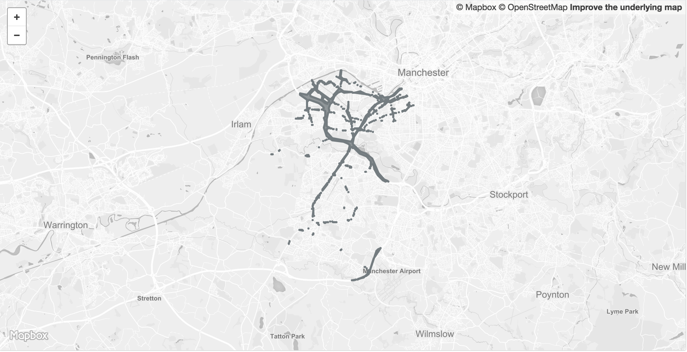

<table>
<tr>
	<td>Dataset name</td>
	<td>Air Quality Management Areas (AQMAs)</td>
</tr>
<tr>
	<td>Dataset description</td>
	<td>Air Quality Management Areas in Trafford and Greater Manchester</td>
</tr>
<tr>
	<td>Source</td>
	<td>Department for Environment Food & Rural Affairs (Defra)</td>
</tr>
<tr>
	<td>Publisher</td>
	<td>Department for Environment Food & Rural Affairs (Defra)</td>
</tr>
<tr>
	<td>Publisher URL</td>
	<td>http://uk-air.defra.gov.uk/aqma/maps</td>
</tr>
<tr>
	<td>Geography</td>
	<td>Local authority, Combined Authority</td>
</tr>
<tr>
	<td>Geographic coverage</td>
	<td>Trafford, Greater Manchester</td>
</tr>
<tr>
	<td>Temporal coverage</td>
	<td>June 2018</td>
</tr>
<tr>
	<td>Update frequency</td>
	<td>Unknown</td>
</tr>
<tr>
	<td>Licence</td>
	<td><a href="http://www.nationalarchives.gov.uk/doc/open-government-licence/version/3/">Open Government Licence</a></td>
</tr>
<tr>
	<td>Attribution</td>
	<td></td>
</tr>
<tr>
	<td>Format</td>
	<td>GeoJSON</td>
</tr>
<tr>
	<td>Openness rating</td>
	<td>&#9733&#9733&#9733&#9734&#9734&nbsp; Structured data in open format (e.g. CSV)</td>
</tr>
<tr>
	<td>Last updated</td>
	<td>September 2018</td>
</tr>
<tr>
	<td>Notes</td>
	<td></td>
</tr>
<tr>
	<td>Lab visualisation</td>
	<td>View data within the Lab's <a href="https://www.trafforddatalab.io/maps/explore/index.html?dataset=air_quality">Explore application</a>.</td>
</tr>
</table>
