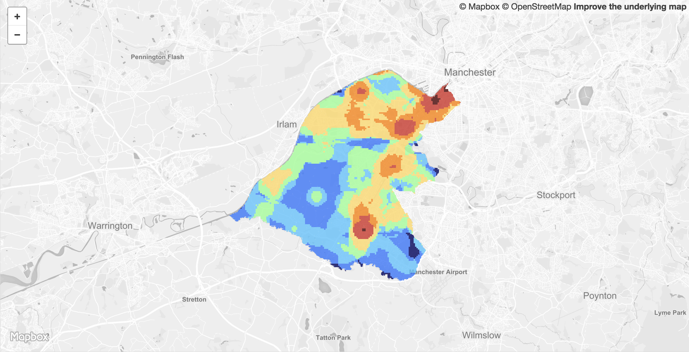

<table>
<tr>
	<td>Dataset name</td>
	<td>Greater Manchester Accessibility Levels</td>
</tr>
<tr>
	<td>Dataset description</td>
	<td>GMAL is a measure which rates locations by their distance from frequent public transport services</td>
</tr>
<tr>
	<td>Source</td>
	<td>TfGM</td>
</tr>
<tr>
	<td>Publisher</td>
	<td>TfGM</td>
</tr>
<tr>
	<td>Publisher URL</td>
	<td><a href="https://data.gov.uk/dataset/d9dfbf0a-3cd7-4b12-a39f-0ec717423ee4/gm-accessibility-levels-gmal">https://data.gov.uk/dataset/d9dfbf0a-3cd7-4b12-a39f-0ec717423ee4/gm-accessibility-levels-gmal</a></td>
</tr>
<tr>
	<td>Geography</td>
	<td>Local Authority, Combined Authority</td>
</tr>
<tr>
	<td>Geographic coverage</td>
	<td>Trafford, Greater Manchester</td>
</tr>
<tr>
	<td>Temporal coverage</td>
	<td>2016-03-30</td>
</tr>
<tr>
	<td>Update frequency</td>
	<td>Unknown</td>
</tr>
<tr>
	<td>Licence</td>
	<td><a href="http://www.nationalarchives.gov.uk/doc/open-government-licence/version/3/">Open Government Licence</a></td>
</tr>
<tr>
	<td>Attribution</td>
	<td>Contains Transport for Greater Manchester data.</td>
</tr>
<tr>
	<td>Format</td>
	<td>GeoJSON</td>
</tr>
<tr>
	<td>Openness rating</td>
	<td>&#9733&#9733&#9733&#9734&#9734&nbsp; Structured data in open format (e.g. CSV)</td>
</tr>
<tr>
	<td>Last updated</td>
	<td>September 2018</td>
</tr>
<tr>
	<td>Notes</td>
	<td></td>
</tr>
<tr>
	<td>Lab visualisation</td>
	<td>View data within the Lab's <a href="https://www.trafforddatalab.io/maps/explore/index.html?dataset=public_transport_accessibility">Explore application</a>.</td>
</tr>
</table>
