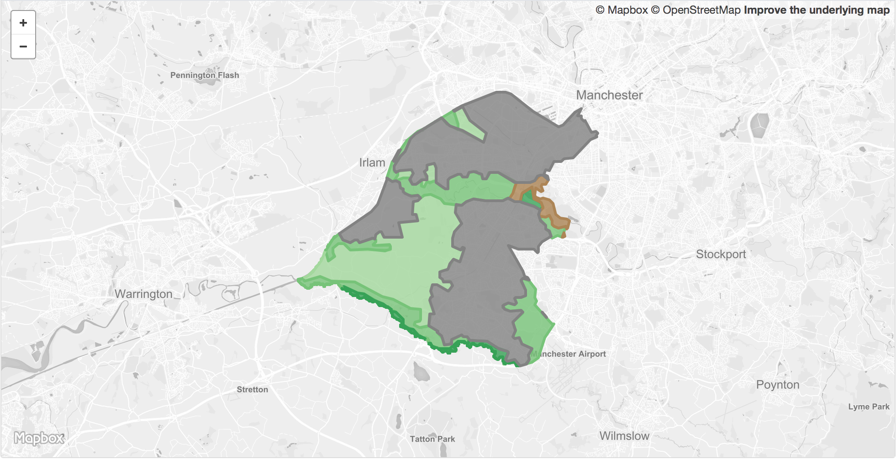

<table>
<tr>
	<td>Dataset name</td>
	<td>Agricultural land classification</td>
</tr>
<tr>
	<td>Dataset description</td>
	<td>Five grades of agricultural land (1 = best quality to 5 = poorest quality) with classifications for urban and non-agricultural land in Trafford.</td>
</tr>
<tr>
	<td>Source</td>
	<td>Natural England</td>
</tr>
<tr>
	<td>Publisher</td>
	<td>Natural England</td>
</tr>
<tr>
	<td>Publisher URL</td>
	<td>	http://naturalengland-defra.opendata.arcgis.com/datasets/provisional-agricultural-land-classification-alc-england</td>
</tr>
<tr>
	<td>Geography</td>
	<td>Local authority, Combined Authority</td>
</tr>
<tr>
	<td>Geographic coverage</td>
	<td>Trafford, Greater Manchester</td>
</tr>
<tr>
	<td>Temporal coverage</td>
	<td>2018-02</td>
</tr>
<tr>
	<td>Update frequency</td>
	<td>Unknown</td>
</tr>
<tr>
	<td>Licence</td>
	<td><a href="http://www.nationalarchives.gov.uk/doc/open-government-licence/version/3/">Open Government Licence</a></td>
</tr>
<tr>
	<td>Attribution</td>
	<td>&copy; Natural England copyright. Contains Ordnance Survey data &copy; Crown copyright and database right [year].</td>
</tr>
<tr>
	<td>Format</td>
	<td>GeoJSON</td>
</tr>
<tr>
	<td>Openness rating</td>
	<td>&#9733&#9733&#9733&#9734&#9734&nbsp; Structured data in open format (e.g. CSV)</td>
</tr>
<tr>
	<td>Last updated</td>
	<td>2019-04-10</td>
</tr>
<tr>
	<td>Notes</td>
	<td></td>
</tr>
<tr>
	<td>Lab visualisation</td>
	<td>View data within the Lab's <a href="https://www.trafforddatalab.io/explore/#dataset=agricultural_land">Explore application</a>.</td>
</tr>
</table>
