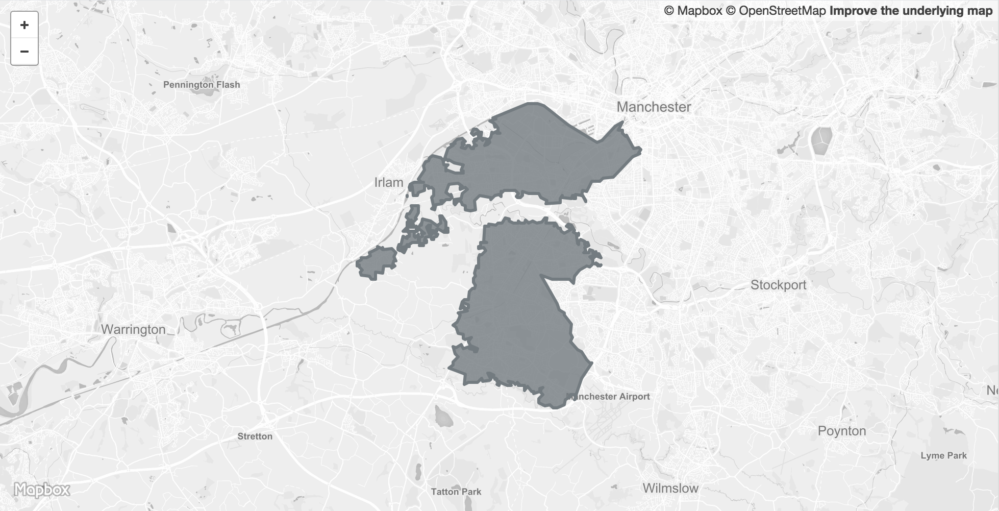

 

<table>
<tr>
	<td>Dataset name</td>
	<td>Built-Up Areas, 2011</td>
</tr>
<tr>
	<td>Dataset description</td>
	<td>Built-up areas in Greater Manchester as at 27 March 2011</td>
</tr>
<tr>
	<td>Source</td>
	<td>Office for National Statistics and Ordnance Survey</td>
</tr>
<tr>
	<td>Publisher</td>
	<td>Office for National Statistics</td>
</tr>
<tr>
	<td>Publisher URL</td>
	<td>http://geoportal.statistics.gov.uk/datasets/f6684981be23404e83321077306fa837_0</td>
</tr>
<tr>
	<td>Geography</td>
	<td>50m grid squares</td>
</tr>
<tr>
	<td>Geographic coverage</td>
	<td>Greater Manchester</td>
</tr>
<tr>
	<td>Temporal coverage</td>
	<td>March 2011</td>
</tr>
<tr>
	<td>Update frequency</td>
	<td>Unknown</td>
</tr>
<tr>
	<td>Licence</td>
	<td><a href="http://www.nationalarchives.gov.uk/doc/open-government-licence/version/3/">Open Government Licence</a></td>
</tr>
<tr>
	<td>Attribution</td>
	<td>Contains National Statistics data © Crown copyright and database right 2018</td>
</tr>
<tr>
	<td>Format</td>
	<td>GeoJSON</td>
</tr>
<tr>
	<td>Openness rating</td>
	<td>&#9733&#9733&#9733&#9734&#9734&nbsp; Structured data in open format (e.g. CSV)</td>
</tr>
<tr>
	<td>Last updated</td>
	<td>June 2017</td>
</tr>
<tr>
	<td>Notes</td>
	<td></td>
</tr>
<tr>
	<td>Lab visualisation</td>
	<td></td>
</tr>
</table>
