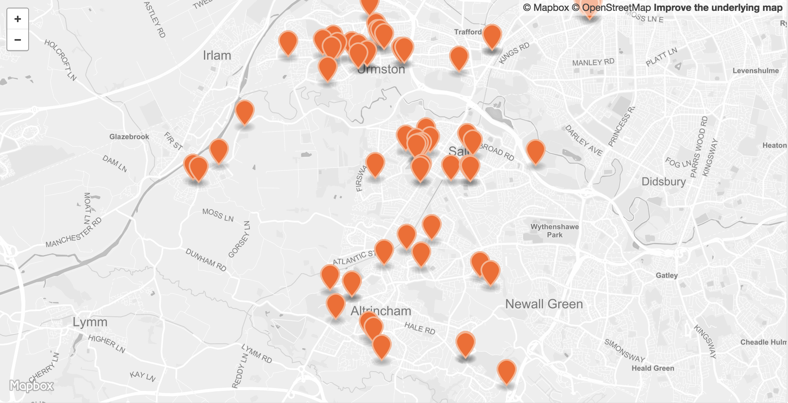

<table>
<tr>
	<td>Dataset name</td>
	<td>Care homes</td>
</tr>
<tr>
	<td>Dataset description</td>
	<td>Nursing and residential care homes in Trafford and Greater Manchester</td>
</tr>
<tr>
	<td>Source</td>
	<td>Care Quality Commission</td>
</tr>
<tr>
	<td>Publisher</td>
	<td>Care Quality Commission</td>
</tr>
<tr>
	<td>Publisher URL</td>
	<td>http://www.cqc.org.uk/about-us/transparency/using-cqc-data</td>
</tr>
<tr>
	<td>Geography</td>
	<td>Point data</td>
</tr>
<tr>
	<td>Geographic coverage</td>
	<td>Trafford, Greater Manchester</td>
</tr>
<tr>
	<td>Temporal coverage</td>
	<td>Correct as of September 2018</td>
</tr>
<tr>
	<td>Update frequency</td>
	<td>Weekly</td>
</tr>
<tr>
	<td>Licence</td>
	<td><a href="http://www.nationalarchives.gov.uk/doc/open-government-licence/version/3/">Open Government Licence</a></td>
</tr>
<tr>
	<td>Attribution</td>
	<td></td>
</tr>
<tr>
	<td>Format</td>
	<td>CSV, GeoJSON</td>
</tr>
<tr>
	<td>Openness rating</td>
	<td>&#9733&#9733&#9733&#9734&#9734&nbsp; Structured data in open format (e.g. CSV)</td>
</tr>
<tr>
	<td>Last updated</td>
	<td>September 2018</td>
</tr>
<tr>
	<td>Notes</td>
	<td></td>
</tr>
<tr>
	<td>Lab visualisation</td>
	<td>View data within the Lab's <a href="https://www.trafforddatalab.io/maps/explore/index.html?dataset=care_homes">Explore application</a>.</td>
</tr>
</table>
