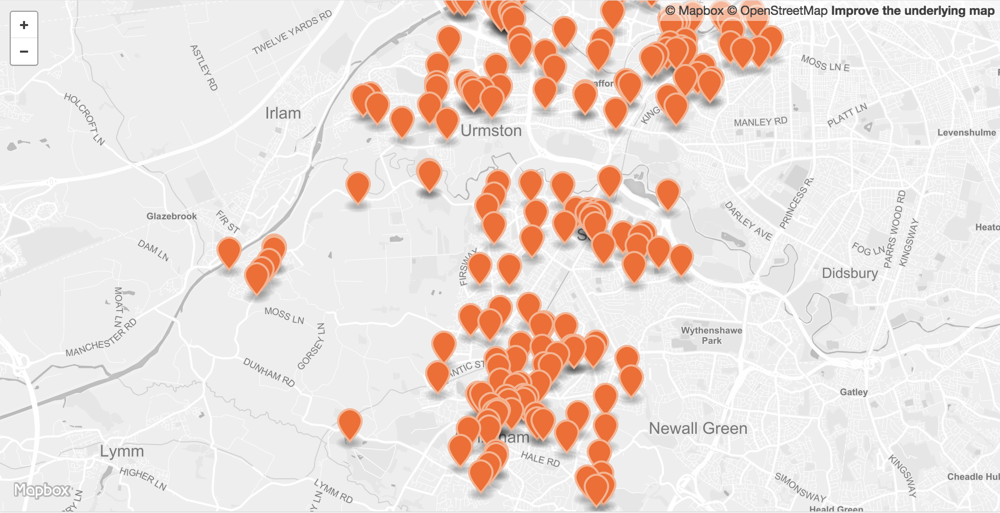

<head>

</head>

 

<table>
<tr>
	<td>Dataset name</td>
	<td>Defibrillators</td>
</tr>
<tr>
	<td>Dataset description</td>
	<td>Defibrillator locations within Trafford</td>
</tr>
<tr>
	<td>Source</td>
	<td>Councillor Butt's Mayoral Charity, <a href="http://www.handonheart.org/">Hand on Heart</a> and crowd sourcing</td>
</tr>
<tr>
	<td>Publisher</td>
	<td>Trafford Council</td>
</tr>
<tr>
	<td>Publisher URL</td>
	<td><a href="https://www.traffordDataLab.io/open_data/defibrillators">https://www.traffordDataLab.io/open_data/defibrillators</a></td>
</tr>
<tr>
	<td>Geography</td>
	<td>Local authority</td>
</tr>
<tr>
	<td>Geographic coverage</td>
	<td>Trafford</td>
</tr>
<tr>
	<td>Temporal coverage</td>
	<td>Correct as of January 2017</td>
</tr>
<tr>
	<td>Update frequency</td>
	<td>Not known</td>
</tr>
<tr>
	<td>Licence</td>
	<td><a href="http://www.nationalarchives.gov.uk/doc/open-government-licence/version/3/">Open Government Licence</a></td>
</tr>
<tr>
	<td>Attribution</td>
	<td></td>
</tr>
<tr>
	<td>Format</td>
	<td>CSV, GeoJSON, JSON</td>
</tr>
<tr>
	<td>Openness rating</td>
	<td>&#9733&#9733&#9733&#9734&#9734&nbsp; Structured data in open format (e.g. CSV)</td>
</tr>
<tr>
	<td>Last updated</td>
	<td>January 2017</td>
</tr>
<tr>
	<td>Notes</td>
	<td>Please note that these defibrillators may have restrictions on public availability and may not be available 24/7. The locations may not be exact as they are derived from postcodes.</td>
</tr>
</table>
