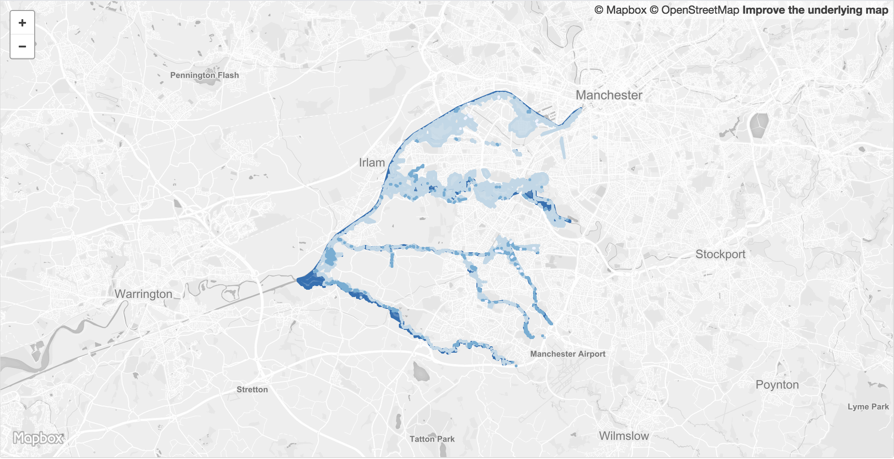

 

<table>
<tr>
	<td>Dataset name</td>
	<td>Risk of Flooding from Rivers and Sea</td>
</tr>
<tr>
	<td>Dataset description</td>
	<td>The dataset shows the chance of flooding from rivers and/or the sea, based on 50m cells in Traffordf. Each cell is allocated to one of four flood risk categories, taking into account flood defences and their condition.
</td>
</tr>
<tr>
	<td>Source</td>
	<td>Environment Agency</td>
</tr>
<tr>
	<td>Publisher</td>
	<td>Environment Agency</td>
</tr>
<tr>
	<td>Publisher URL</td>
	<td>https://data.gov.uk/dataset/risk-of-flooding-from-rivers-and-sea1</td>
</tr>
<tr>
	<td>Geography</td>
	<td>Local Authority</td>
</tr>
<tr>
	<td>Geographic coverage</td>
	<td>Trafford</td>
</tr>
<tr>
	<td>Temporal coverage</td>
	<td>April 2017</td>
</tr>
<tr>
	<td>Update frequency</td>
	<td>Unknown</td>
</tr>
<tr>
	<td>Licence</td>
	<td><a href="http://www.nationalarchives.gov.uk/doc/open-government-licence/version/3/">Open Government Licence</a></td>
</tr>
<tr>
	<td>Attribution</td>
	<td>© Environment Agency copyright and/or database right 2017. All rights reserved. Some features of this map are based on digital spatial data from the Centre for Ecology & Hydrology, © NERC (CEH)© Crown copyright and database rights 2017 Ordnance Survey 100024198.</td>
</tr>
<tr>
	<td>Format</td>
	<td>GeoJSON</td>
</tr>
<tr>
	<td>Openness rating</td>
	<td>&#9733&#9733&#9733&#9734&#9734&nbsp; Structured data in open format (e.g. CSV)</td>
</tr>
<tr>
	<td>Last updated</td>
	<td>March 2018</td>
</tr>
<tr>
	<td>Notes</td>
	<td></td>
</tr>
<tr>
	<td>Lab visualisation</td>
	<td>View data within the Lab's <a href="https://www.trafforddatalab.io/maps/explore/index.html?dataset=flood_risk">Explore application</a>.</td>
</tr>
</table>
