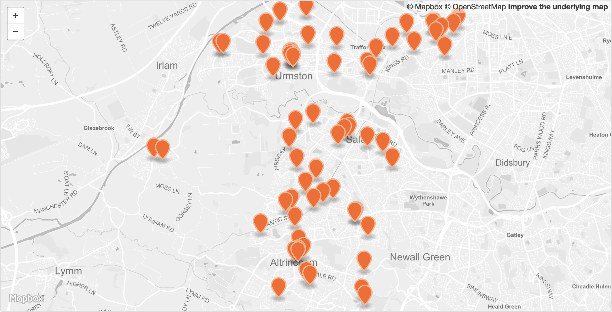

 

<table>
<tr>
	<td>Dataset name</td>
	<td>Trafford pharmacies</td>
</tr>
<tr>
	<td>Dataset description</td>
	<td>Dataset containing the location of pharmacies in Trafford.</td>
</tr>
<tr>
	<td>Source</td>
	<td>Trafford Council</td>
</tr>
<tr>
	<td>Publisher</td>
	<td>Trafford Council</td>
</tr>
<tr>
	<td>Publisher URL</td>
	<td>http://www.trafford.gov.uk/about-your-council/children-families-and-wellbeing/children-families-and-wellbeing.aspx</td>
</tr>
<tr>
	<td>Geography</td>
	<td>Points</td>
</tr>
<tr>
	<td>Geographic coverage</td>
	<td>Trafford</td>
</tr>
<tr>
	<td>Temporal coverage</td>
	<td>May 2018</td>
</tr>
<tr>
	<td>Update frequency</td>
	<td>Unknown</td>
</tr>
<tr>
	<td>Licence</td>
	<td><a href="http://www.nationalarchives.gov.uk/doc/open-government-licence/version/3/">Open Government Licence</a></td>
</tr>
<tr>
	<td>Format</td>
	<td>CSV, GeoJSON</td>
</tr>
<tr>
	<td>Openness rating</td>
	<td>&#9733&#9733&#9733&#9734&#9734&nbsp; Structured data in open format (e.g. CSV)</td>
</tr>
<tr>
	<td>Last updated</td>
	<td>May 2018</td>
</tr>
<tr>
	<td>Notes</td>
	<td></td>
</tr>
<tr>
	<td>Lab visualisation</td>
	<td>View data within the Lab's <a href="https://www.trafforddatalab.io/maps/explore/index.html?title=Pharmacies&about=Locations%20of%20pharmacies%20in%20Trafford.%3cbr%20%2f%3e%3cbr%20%2f%3eDownload%3a%20%3ca%20href%3d%22https%3a%2f%2fwww.trafforddatalab.io%2fopen_data%2fpharmacies%2ftrafford_pharmacies.csv%22%20target%3d%22_blank%22%3eCSV%3c%2fa%3e%20%7c%20%3ca%20href%3d%22https%3a%2f%2fwww.trafforddatalab.io%2fopen_data%2fpharmacies%2ftrafford_pharmacies.geojson%22%20target%3d%22_blank%22%3eGeoJSON%3c%2fa%3e.%3cbr%20%2f%3eFurther%20resources%20available%20%3ca%20href%3d%22https%3a%2f%2fgithub.com%2ftraffordDataLab%2fopen_data%2ftree%2fmaster%2fpharmacies%22%20target%3d%22_blank%22%3eon%20GitHub%3c%2fa%3e.&attr=Trafford%20Council&data=https://www.trafforddatalab.io/open_data/pharmacies/trafford_pharmacies.geojson">Explore application</a>.</td>
</tr>
</table>
