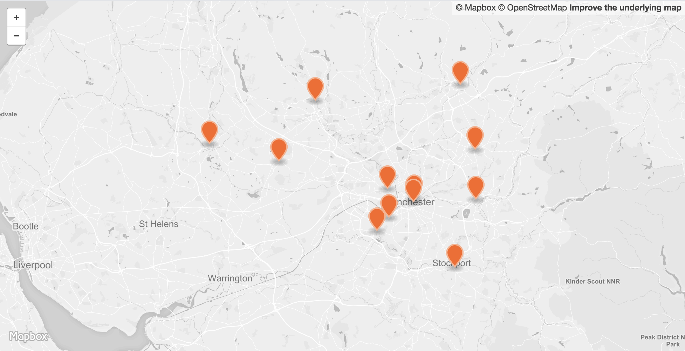

 

<table>
<tr>
	<td>Dataset name</td>
	<td>Probation offices</td>
</tr>
<tr>
	<td>Dataset description</td>
	<td>Dataset containing the locations of NPS and CRC probation offices across Greater Manchester.</td>
</tr>
<tr>
	<td>Source</td>
	<td>Cheshire & Greater Manchester CRC</td>
</tr>
<tr>
	<td>Publisher</td>
	<td>Cheshire & Greater Manchester CRC</td>
</tr>
<tr>
	<td>Publisher URL</td>
	<td>http://www.cgmcrc.co.uk/contact-us/our-offices/</td>
</tr>
<tr>
	<td>Geography</td>
	<td>Points</td>
</tr>
<tr>
	<td>Geographic coverage</td>
	<td>Greater Manchester</td>
</tr>
<tr>
	<td>Temporal coverage</td>
	<td>Unknown</td>
</tr>
<tr>
	<td>Update frequency</td>
	<td>Unknown</td>
</tr>
<tr>
	<td>Licence</td>
	<td><a href="http://www.nationalarchives.gov.uk/doc/open-government-licence/version/3/">Open Government Licence</a></td>
</tr>
<tr>
	<td>Format</td>
	<td>CSV, GeoJSON</td>
</tr>
<tr>
	<td>Openness rating</td>
	<td>&#9733&#9733&#9733&#9734&#9734&nbsp; Structured data in open format (e.g. CSV)</td>
</tr>
<tr>
	<td>Last updated</td>
	<td>Unknown</td>
</tr>
<tr>
	<td>Notes</td>
	<td></td>
</tr>
<tr>
	<td>Lab visualisation</td>
	<td></td>
</tr>
</table>
