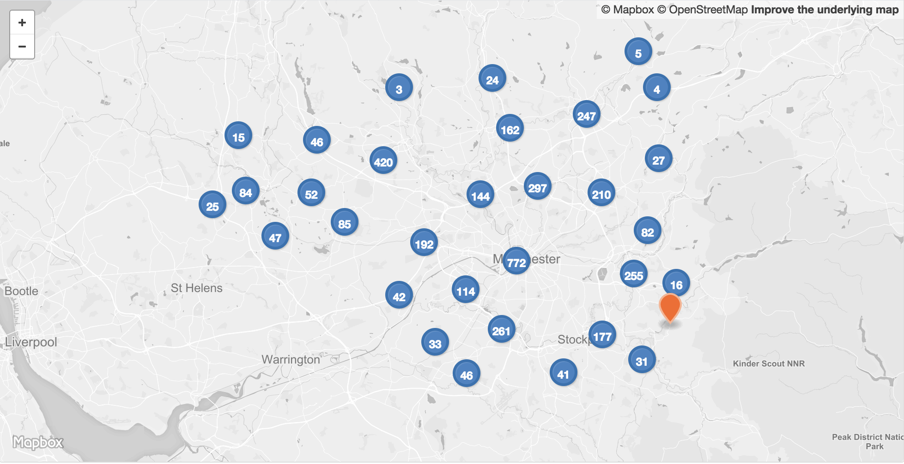

 

<table>
<tr>
	<td>Dataset name</td>
	<td>STATS19 road casualties </td>
</tr>
<tr>
	<td>Dataset description</td>
	<td>Road accidents involving personal injury recorded by Greater Manchester Police during 2016.</td>
</tr>
<tr>
	<td>Source</td>
	<td>Greater Manchester Police</td>
</tr>
<tr>
	<td>Publisher</td>
	<td>Department for Transport</td>
</tr>
<tr>
	<td>Publisher URL</td>
	<td>https://data.gov.uk/dataset/road-accidents-safety-data</td>
</tr>
<tr>
	<td>Geography</td>
	<td>Point data</td>
</tr>
<tr>
	<td>Geographic coverage</td>
	<td>Greater Manchester</td>
</tr>
<tr>
	<td>Temporal coverage</td>
	<td>1 year</td>
</tr>
<tr>
	<td>Update frequency</td>
	<td>Annual</td>
</tr>
<tr>
	<td>Licence</td>
	<td><a href="http://www.nationalarchives.gov.uk/doc/open-government-licence/version/3/">Open Government Licence</a></td>
</tr>
<tr>
	<td>Attribution</td>
	<td></td>
</tr>
<tr>
	<td>Format</td>
	<td>CSV, GeoJSON</td>
</tr>
<tr>
	<td>Openness rating</td>
	<td>&#9733&#9733&#9733&#9734&#9734&nbsp; Structured data in open format (e.g. CSV)</td>
</tr>
<tr>
	<td>Last updated</td>
	<td>March 2018</td>
</tr>
<tr>
	<td>Notes</td>
	<td></td>
</tr>
<tr>
	<td>Lab visualisation</td>
	<td></td>
</tr>
</table>
