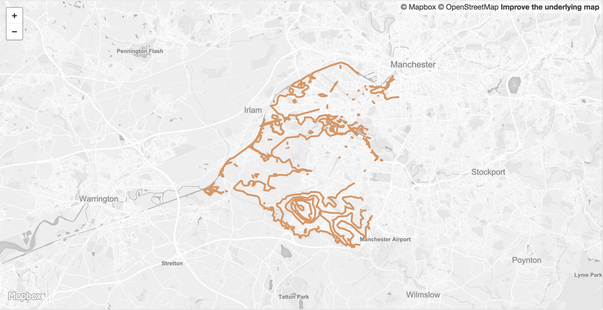

 

<table>
<tr>
	<td>Dataset name</td>
	<td>OS Terrain 50</td>
</tr>
<tr>
	<td>Dataset description</td>
	<td>10m contours and spot heights constrained by the boundaries of Trafford borough and the Greater Manchester Combined Authority</td>
</tr>
<tr>
	<td>Source</td>
	<td>Ordnance Survey</td>
</tr>
<tr>
	<td>Publisher</td>
	<td>Ordnance Survey</td>
</tr>
<tr>
	<td>Publisher URL</td>
	<td>https://www.ordnancesurvey.co.uk/business-and-government/products/terrain-50.html</td>
</tr>
<tr>
	<td>Geography</td>
	<td>Local Authority, Combined Authority</td>
</tr>
<tr>
	<td>Geographic coverage</td>
	<td>Trafford and Greater Manchester</td>
</tr>
<tr>
	<td>Temporal coverage</td>
	<td>Current</td>
</tr>
<tr>
	<td>Update frequency</td>
	<td>Yearly</td>
</tr>
<tr>
	<td>Licence</td>
	<td><a href="http://www.nationalarchives.gov.uk/doc/open-government-licence/version/3/">Open Government Licence</a></td>
</tr>
<tr>
	<td>Attribution</td>
	<td>Contains Ordnance Survey data © Crown copyright and database right 2018</td>
</tr>
<tr>
	<td>Format</td>
	<td>CSV, GeoJSON</td>
</tr>
<tr>
	<td>Openness rating</td>
	<td>&#9733&#9733&#9733&#9734&#9734&nbsp; Structured data in open format (e.g. CSV)</td>
</tr>
<tr>
	<td>Last updated</td>
	<td>February 2018</td>
</tr>
<tr>
	<td>Notes</td>
	<td></td>
</tr>
<tr>
	<td>Lab visualisation</td>
	<td>View data within the Lab's <a href="https://www.trafforddatalab.io/maps/explore/index.html?dataset=terrain_contours">Explore application</a>.</td>
</tr>
</table>
