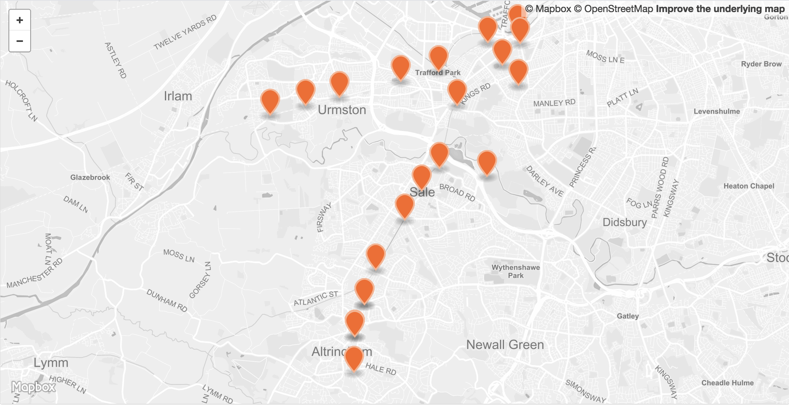

 

<table>
<tr>
	<td>Dataset name</td>
	<td>Metrolink stops in Trafford</td>
</tr>
<tr>
	<td>Dataset description</td>
	<td>The location of Metrolink stops in Trafford</td>
</tr>
<tr>
	<td>Source</td>
	<td>Transport for Greater Manchester</td>
</tr>
<tr>
	<td>Publisher</td>
	<td>Transport for Greater Manchester</td>
</tr>
<tr>
	<td>Publisher URL</td>
	<td>https://data.gov.uk/dataset/8faea7ee-eb7d-43dd-b1d4-f01aac4c44d3/metrolink-stops-and-rail-stations</td>
</tr>
<tr>
	<td>Geography</td>
	<td>Points</td>
</tr>
<tr>
	<td>Geographic coverage</td>
	<td>Trafford</td>
</tr>
<tr>
	<td>Temporal coverage</td>
	<td>NA</td>
</tr>
<tr>
	<td>Update frequency</td>
	<td>Unknown</td>
</tr>
<tr>
	<td>Licence</td>
	<td><a href="http://www.nationalarchives.gov.uk/doc/open-government-licence/version/3/">Open Government Licence</a></td>
</tr>
<tr>
	<td>Attribution</td>
	<td>Contains Transport for Greater Manchester data. Contains OS data © Crown copyright and database right 2018.</td>
</tr>
<tr>
	<td>Format</td>
	<td>CSV, GeoJSON</td>
</tr>
<tr>
	<td>Openness rating</td>
	<td>&#9733&#9733&#9733&#9734&#9734&nbsp; Structured data in open format (e.g. CSV)</td>
</tr>
<tr>
	<td>Last updated</td>
	<td>Unknown</td>
</tr>
<tr>
	<td>Notes</td>
	<td></td>
</tr>
<tr>
	<td>Lab visualisation</td>
	<td></td>
</tr>
</table>
