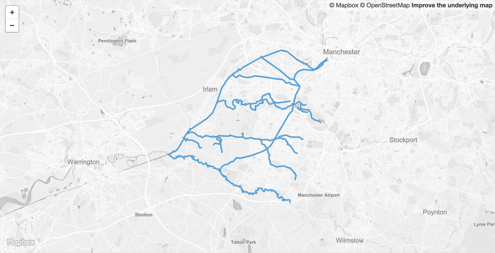

 

<table>
<colgroup>
<col style="text-align:left;"/>
<col style="text-align:left;"/>
</colgroup>

<tbody>
<tr>
	<td style="text-align:left;"><strong>Dataset name</strong></td>
	<td style="text-align:left;">Watercourses</td>
</tr>
<tr>
	<td style="text-align:left;"><strong>Dataset description</strong></td>
	<td style="text-align:left;">Rivers and other waterways constrained by the boundaries of Trafford borough and the Greater Manchester Combined Authority.</td>
</tr>
<tr>
	<td style="text-align:left;"><strong>Source</strong></td>
	<td style="text-align:left;">Ordnance Survey</td>
</tr>
<tr>
	<td style="text-align:left;"><strong>Publisher</strong></td>
	<td style="text-align:left;">OS Open Rivers</td>
</tr>
<tr>
	<td style="text-align:left;"><strong>Publisher URL</strong></td>
	<td style="text-align:left;"><a href="https://www.ordnancesurvey.co.uk/business-and-government/products/os-open-rivers.html">https://www.ordnancesurvey.co.uk/business-and-government/products/os-open-rivers.html
</a></td>
</tr>
<tr>
	<td style="text-align:left;"><strong>Geography</strong></td>
	<td style="text-align:left;">Local authority</td>
</tr>
<tr>
	<td style="text-align:left;"><strong>Geographic coverage</strong></td>
	<td style="text-align:left;">Trafford</td>
</tr>
<tr>
	<td style="text-align:left;"><strong>Temporal coverage</strong></td>
	<td style="text-align:left;">December 2017</td>
</tr>
<tr>
	<td style="text-align:left;"><strong>Update frequency</strong></td>
	<td style="text-align:left;">Unknown</td>
</tr>
<tr>
	<td style="text-align:left;"><strong>Licence</strong></td>
	<td style="text-align:left;"><a href="http://www.nationalarchives.gov.uk/doc/open-government-licence/version/3/">Open Government Licence</a></td>
</tr>
<tr>
	<td style="text-align:left;"><strong>Attribution</strong></td>
	<td style="text-align:left;">Contains Ordnance Survey data © Crown copyright and database right 2018</td>
</tr>
<tr>
	<td style="text-align:left;"><strong>Format</strong></td>
	<td style="text-align:left;">GeoJSON</td>
</tr>
<tr>
	<td style="text-align:left;"><strong>Openness rating</strong></td>
	<td style="text-align:left;">&#9733&#9733&#9733&#9734&#9734&nbsp; Structured data in open format (e.g. CSV)</td>
</tr>
<tr>
	<td style="text-align:left;"><strong>Last updated</strong></td>
	<td style="text-align:left;">March 2018</td>
</tr>
</tbody>
</table>
